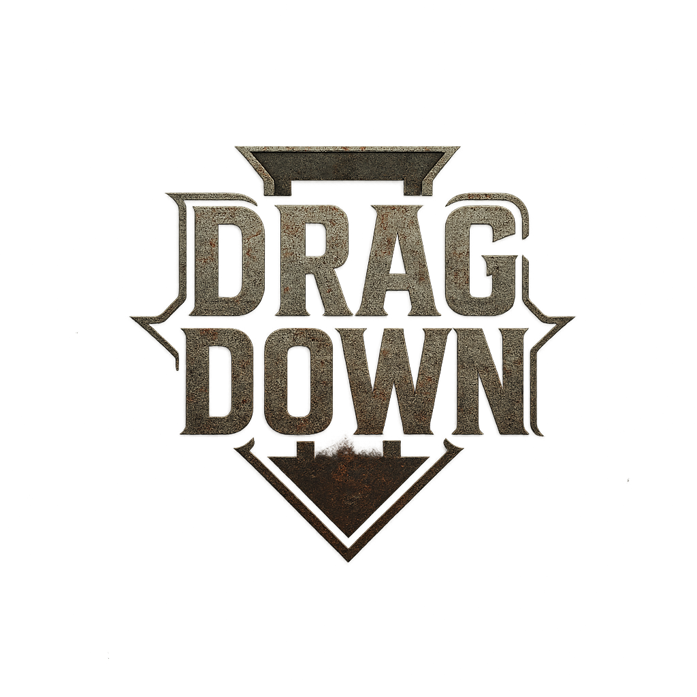
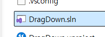
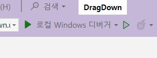

2025-1학기 단국대학교 캡스톤 디자인

# 1. Project Overview
- Project Name: Drag Down
- Game Genre: Multiplayer competitive platform game

## 프로젝트 참여자
| 정현우 | 변성준 | 박지원 |
|:------:|:------:|:------:|
| Game Client | Backend | PM & DevOps |
| [GitHub](https://github.com/Lagooneng) | [GitHub](https://github.com/Coffeecaat) |  |

## 진행 기간
2025.03.12 ~ 2025.06.11

# 2. 주요 기능 및 구현 (게임 백엔드 서버)

- **회원가입 및 로그인 API**
  - FHttpModule을 이용하여 게임 클라이언트의 회원가입 혹은 로그인 요청을 받고, 이를 처리한 응답을 게임 클라이언트에 보냄
  - 중복값 체크를 통해 이미 가입에 사용된 이메일 혹은 아이디 값인지 검증
 
- **단일 토큰 기반 인증**
  - 유저 로그인 성공 시 백엔드 서버에서 생성한 JWT를 유저의 클라이언트에 응답 값과 함께 반환
  - 로그인에 성공한 유저에게 토큰 생성 및 부여
  - 유저 클라이언트가 가지고 있는 토큰에 대한 검증 및 파싱 
 
- **매치메이킹 API**
  - 유효한 토큰을 가지고 있는 유저들은 게임 방의 생성, 참여, 퇴장 및 현재 존재하는 방 목록 조회 가능
  - 게임 방에서 최소 참여 인원(2명)을 충족한 상태에서 호스트 유저가 게임 시작 가능


# 3. Teck Stack
## Game Client
- Unreal Engine 5.5.4
- Gameplay Ability System
  - Local Prediction
- Listen Server

## Backend
- Spring Boot
- PostgrSQL
- Redis

# 4. 프로젝트 구조
```plaintext
📁 src
└── 📁 main
    ├── 📁 java
    │   └── 📁 com
    │       └── 📁 example
    │           └── 📁 DragDown
    │               ├── 📁 Config                  # 보안 및 Redis 루아 스크립트 설정 클래스들
    │               ├── 📁 Controller              # 회원가입, 로그인, 매치메이킹 API
    │               ├── 📁 Dto                     # DTO 파일들
    │               │    ├── 📁 AuthDto            # 회원가입, 로그인 DTO
    │               │    ├── 📁 MatchDto           # 매치메이킹 DTO
    │               │    ├── 📜 ErrorResponse      # Error DTO
    │               │    └── 📜 MessageResponse    # Message DTO
    │               ├── 📁 Exception               # 예외 처리 관련 클래스들
    │               ├── 📁 Model                   # 유저 엔티티
    │               ├── 📁 Repository              # 회원가입, 로그인, 매치메이킹 리포지토리 클래스들
    │               ├── 📁 Security                # Config를 제외한 보안 관련 클래스들
    │               ├── 📁 Service                 # 회원가입, 로그인, 매치메이킹 서비스 클래스들
    │               ├── 📁 Utils                   # 토큰 생성,검증, 파싱 클래스
    │               └── 📜 DragDownApplication.java
    └── 📁 resources
        └── 📁 scripts
            ├── 📜 join_room.lua                   # 방 참여 관련 루아 스크립트
            └── 📜 leave_room.lua                  # 방 퇴장 관련 루아 스크립트
```

# 5. 실행 방법
## 5.1. 패키징된 파일이 있는 경우
- exe 파일 실행

## 5.2. Github에서 Clone하기
### 5.2.1. Unreal Engine 5.5 설치
- [설치](https://www.unrealengine.com/ko/download)

### 5.2.2. Clone 후 uproject 나 Visual Studio에서 실행

- .uproject 더블클릭

혹은

- Visual Studio를 켜고


- 실행하기

# 6. 관련 링크
## 시연 영상
[Youtube](https://www.youtube.com/watch?v=jUFSaVU_6lU)

## 게임 클라이언 리포지토리
[DragDown Unreal Engine Game Client GitHub Repository](https://github.com/Lagooneng/DragDown)
## Game Client
- Unreal Engine 5.5.4
- Gameplay Ability System
  - Local Prediction
- Listen Server
- => Game Client!
