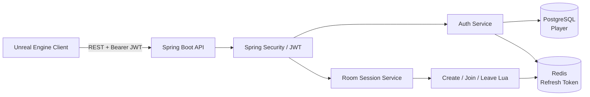

<p align="center">
  
</p>

# DragDown Backend

Unreal Engine 기반 멀티플레이 대전 게임의 인증과 룸 세션을 관리하는 Spring Boot 백엔드입니다.

> 2025년 1학기 단국대학교 캡스톤 디자인 · 2025.03.12 ~ 2025.06.11

## 프로젝트 개요

DragDown은 Listen Server 방식으로 플레이하는 사용자가 로그인한 뒤 대기 방을 생성하고, 참여하고, 게임을 시작할 수 있도록 지원합니다. 이 저장소는 게임 플레이 동기화 서버가 아니라 다음 백엔드 기능을 담당합니다.

- 회원가입, 로그인, 액세스 토큰 갱신 및 로그아웃
- 참여 가능한 룸 생성·조회·입장·퇴장
- 호스트 권한 및 최소·최대 인원 검증
- 사용자별 룸 위치와 게임 접속 Endpoint 관리
- 동시 요청에서 룸 정원과 사용자 상태의 정합성 유지

시연 영상: [YouTube](https://www.youtube.com/watch?v=jUFSaVU_6lU)

게임 클라이언트: [DragDown Unreal Engine Client](https://github.com/Lagooneng/DragDown)

## 팀 구성과 담당 범위

| 이름 | 담당 | GitHub |
|---|---|---|
| 정현우 | Game Client | [Lagooneng](https://github.com/Lagooneng) |
| 변성준 | Backend | [Coffeecaat](https://github.com/Coffeecaat) |
| 박지원 | PM · DevOps | - |

백엔드 담당 범위는 Spring Security 기반 인증, PostgreSQL 회원 데이터, Redis 룸 세션, REST API와 동시성 통합 테스트입니다.

## 기술 스택과 선택 이유

| 영역 | 기술 | 사용 목적 |
|---|---|---|
| Language | Java 21 | 백엔드 애플리케이션 구현 |
| Framework | Spring Boot 3.4.3 | REST API, 의존성 관리 및 애플리케이션 구성 |
| Security | Spring Security, JWT, BCrypt | Stateless 인증과 비밀번호 단방향 해시 |
| Persistent Data | PostgreSQL, Spring Data JPA | 사용자 계정과 점수 데이터 저장 |
| Room Session | Redis | 변경이 잦은 룸·참가자·Endpoint 상태 관리 |
| Atomic Operation | Redis Lua Script | 단일 Redis 인스턴스에서 검증과 변경을 하나의 실행으로 처리 |
| Test | JUnit 5, AssertJ, Testcontainers, H2 | 서비스 단위 테스트와 실제 Redis 기반 통합 테스트 |
| Build · CI | Gradle, GitHub Actions | 일반 테스트와 Redis 통합 테스트 자동 검증 |

## 시스템 구성


```mermaid
flowchart LR
    Client[Unreal Engine Client] -->|REST + Bearer JWT| API[Spring Boot API]
    API --> Security[Spring Security / JWT]
    Security --> Auth[Auth Service]
    Security --> Room[Room Session Service]
    Auth --> PostgreSQL[(PostgreSQL\nPlayer)]
    Auth --> Redis[(Redis\nRefresh Token)]
    Room --> Lua[Create / Join / Leave Lua]
    Lua --> Redis
```

게임 플레이 트래픽과 상태 동기화는 Unreal Engine Listen Server가 담당하고, Spring Boot 서버는 인증과 룸 세션 조율을 담당합니다.

## 룸 세션 설계

### Redis 자료구조

| Key | Type | 내용 |
|---|---|---|
| `room:{roomId}:details` | Hash | 방 이름, 호스트, 호스트 IP, 최대 인원, 상태, 생성 시각 |
| `room:{roomId}:players` | Set | 현재 참가자의 username |
| `rooms:active_set` | Set | 활성 상태인 roomId |
| `player:locations` | Hash | `username → roomId` |
| `player:ips` | Hash | `username → ip:port` |
| `user:refresh:{username}` | String | 서버에 보관하는 Refresh Token과 TTL |

Sorted Set은 사용하지 않습니다. 룸 목록은 활성 룸 Set과 각 룸의 details Hash를 조합해 조회하며, 현재 별도의 정렬 기준은 없습니다.

### 원자 처리 범위

- `create_room.lua`: 사용자 기존 위치, roomId 충돌, orphan 키와 Redis 자료형을 쓰기 전에 검사하고 방·호스트 상태를 함께 저장합니다.
- `join_room.lua`: 방 존재 여부, 대기 상태, 정원, 동일·다른 방 참여 여부를 검사한 뒤 참가자·위치·Endpoint를 함께 저장합니다.
- `leave_room.lua`: 오래된 퇴장 요청이 새 방 상태를 지우지 않도록 현재 위치를 먼저 확인합니다. 호스트 또는 마지막 참가자가 퇴장하면 방과 해당 방 참가자 상태를 함께 정리합니다.

같은 사용자의 동시 방 생성, 마지막 한 자리에 대한 동시 입장, 서로 다른 두 방 동시 입장, 호스트 퇴장과 입·퇴장 경쟁 상황을 실제 Redis 통합 테스트로 검증합니다.

### 룸 정책

| 상황 | 처리 |
|---|---|
| 방 정원 | 요청값을 2~4명 범위로 제한 |
| 중복 참여 | 한 사용자는 하나의 룸에만 참여 가능 |
| 정원 경쟁 | 마지막 자리에 여러 요청이 도착해도 한 요청만 성공 |
| 일반 참가자 퇴장 | 해당 사용자의 참가 정보·위치·Endpoint 삭제 |
| 호스트 또는 마지막 참가자 퇴장 | 방을 닫고 해당 방의 참가자 상태 정리 |
| 이미 종료된 퇴장 | 멱등하게 처리하되 다른 방의 새 상태는 보존 |
| 게임 시작 | 호스트이며 현재 인원이 2명 이상일 때 허용 |
| 룸 데이터 수명 | 별도 TTL 없이 유지하고 호스트 또는 마지막 참가자 퇴장 시 명시적으로 삭제 |

## API

인증이 필요한 요청은 다음 헤더를 사용합니다.

```http
Authorization: Bearer <access-token>
```

### 인증 API

| Method | Endpoint | 인증 | 설명 |
|---|---|---|---|
| `POST` | `/api/auth/register` | 불필요 | 회원가입 |
| `POST` | `/api/auth/login` | 불필요 | 로그인 및 Access Token 발급 |
| `POST` | `/api/auth/refresh` | 불필요 | 만료된 Access Token을 이용한 재발급 |
| `POST` | `/api/auth/logout` | 필요 | 서버에 저장된 Refresh Token 삭제 |

### 룸 API

| Method | Endpoint | 설명 |
|---|---|---|
| `POST` | `/api/MatchRooms` | 룸 생성 |
| `GET` | `/api/MatchRooms` | 참여 가능한 룸 목록 조회 |
| `GET` | `/api/MatchRooms/{roomId}` | 룸 상세 조회 |
| `POST` | `/api/MatchRooms/{roomId}/join` | 룸 입장 |
| `DELETE` | `/api/MatchRooms/leave` | 현재 룸 퇴장 |
| `POST` | `/api/MatchRooms/{roomId}/start` | 호스트의 게임 시작 처리 |

룸 생성 요청 예시:

```json
{
  "roomName": "Waiting Room",
  "maxPlayers": 4,
  "ipAddress": "127.0.0.1",
  "port": 7777
}
```

## 로컬 실행

### 요구 사항

- Java 21
- PostgreSQL
- Redis
- Docker Desktop: Redis 통합 테스트 실행 시 필수

### 환경 설정

운영용 접속 정보와 JWT 비밀값은 저장소에 포함하지 않습니다. PowerShell 기준으로 다음 환경변수를 현재 터미널에 설정합니다.

로컬 PostgreSQL과 Redis가 없다면 Docker 실행 예시는 다음과 같습니다.

```powershell
docker run --name dragdown-postgres `
  -e POSTGRES_DB=dragdown `
  -e POSTGRES_USER=dragdown `
  -e POSTGRES_PASSWORD=change-me `
  -p 5432:5432 -d postgres:16-alpine

docker run --name dragdown-redis `
  -p 6379:6379 -d redis:7.4-alpine
```

애플리케이션 실행 환경변수:

```powershell
$env:SPRING_DATASOURCE_URL="jdbc:postgresql://localhost:5432/dragdown"
$env:SPRING_DATASOURCE_USERNAME="dragdown"
$env:SPRING_DATASOURCE_PASSWORD="change-me"
$env:SPRING_JPA_HIBERNATE_DDL_AUTO="update"

$env:SPRING_DATA_REDIS_HOST="localhost"
$env:SPRING_DATA_REDIS_PORT="6379"

$env:JWT_SECRET="<Base64-encoded 256-bit secret>"
$env:JWT_EXPIRATION="3600000"
$env:JWT_REFRESH_EXPIRATION="604800000"
```

`SPRING_JPA_HIBERNATE_DDL_AUTO=update`는 로컬 개발 예시입니다. 운영 환경에서는 마이그레이션 정책에 맞게 별도로 설정해야 합니다.

### 실행

```powershell
git clone https://github.com/Coffeecaat/DragDown.git
cd DragDown
.\gradlew.bat bootRun
```

## 테스트

```powershell
# H2 기반 일반 테스트
.\gradlew.bat test --rerun-tasks --no-daemon

# 실제 Redis 컨테이너 기반 통합 테스트
.\gradlew.bat redisIntegrationTest --rerun-tasks --no-daemon

# 일반 테스트와 Redis 통합 테스트 전체 실행
.\gradlew.bat check --rerun-tasks --no-daemon
```

`redisIntegrationTest`는 Docker를 찾지 못하면 테스트를 건너뛰지 않고 실패합니다. GitHub Actions도 Pull Request와 `main`, `backend-dev` 브랜치 push에서 `check`를 실행합니다.

## 주요 트러블슈팅

### 동일 사용자의 서로 다른 방 동시 입장

초기 입장 스크립트는 방별 참가자 Set만 확인해, 같은 사용자가 두 방에 동시에 요청하면 두 요청이 모두 성공할 수 있었습니다. `player:locations` 확인과 기록을 입장 Lua에 포함하고 실제 Redis에서 두 요청을 동시에 시작하는 테스트로 한 방만 선택되는지 검증했습니다.

### 오래된 퇴장 요청이 새 룸 상태를 삭제하는 문제

방 A를 나간 뒤 방 B에 입장한 사용자에게 과거 방 A의 퇴장 요청이 늦게 도착하면 새 위치와 Endpoint가 삭제될 수 있었습니다. 퇴장 Lua가 어떤 삭제보다 먼저 현재 roomId를 확인하고, 요청 roomId와 다르면 상태를 변경하지 않도록 수정했습니다.

### 방 생성 중 부분 상태와 불명확한 응답

방 생성 과정이 여러 Redis 명령으로 나뉘면 동일 사용자의 동시 요청이나 애플리케이션 종료 시 일부 키만 남을 수 있었습니다. 사전 검증과 상태 기록을 `create_room.lua`로 모았습니다. 스크립트 응답이 불명확할 때는 후보 방의 details·players·active room과 방장 상태를 재조회해 완전 상태, 완전 부재, 부분 상태를 구분합니다.

## 프로젝트 구조

```text
src
├── main
│   ├── java/com/example/DragDown
│   │   ├── Config       # Security, Redis Lua Script 설정
│   │   ├── Controller   # 인증 및 룸 REST API
│   │   ├── Dto          # 요청·응답 DTO
│   │   ├── Exception    # 도메인·공통 예외 처리
│   │   ├── Model        # Player JPA Entity
│   │   ├── Repository   # PostgreSQL 및 Redis 접근
│   │   ├── Security     # JWT 인증 Filter
│   │   ├── Service      # 인증 및 룸 정책
│   │   └── Utils        # JWT 생성·검증
│   └── resources
│       └── scripts
│           ├── create_room.lua
│           ├── join_room.lua
│           └── leave_room.lua
└── test
    └── java/com/example/DragDown
        ├── Repository   # 실제 Redis 기반 생명주기·동시성 통합 테스트
        └── Service      # 룸 서비스 단위 테스트
```

## 현재 상태와 한계

- 이 구현의 `매치메이킹` 범위는 실력 기반 상대 검색이 아니라 인증된 사용자의 룸 세션 생성·참여·종료 관리입니다.
- Lua 원자성은 단일 Redis 인스턴스를 기준으로 검증했습니다. 현재 키 구성은 Redis Cluster의 cross-slot 실행을 지원하지 않습니다.
- 모든 검증을 쓰기 전에 수행하지만 Lua 실행 중 런타임 오류에 대한 자동 롤백을 보장하지 않습니다.
- 생성 스크립트의 응답이 불명확하면 저장 상태를 재조회해 성공·실패·불일치를 판정하지만, 실제 네트워크 응답 유실 자체를 통합 테스트로 재현하지는 않았습니다.
- 게임 시작의 인원 확인과 상태 변경은 아직 하나의 원자 연산이 아니므로 입·퇴장과의 경쟁 조건을 추가로 검토해야 합니다.
- Spring Boot 애플리케이션 재시작만으로 Redis 룸 상태가 삭제되지는 않습니다. Redis 재시작 후 상태 보존 여부는 RDB/AOF 설정에 달려 있으며, 영속성·고가용성·운영 배포 설정은 이 저장소에서 관리하지 않습니다.
- OpenAPI/Swagger 문서는 아직 구성하지 않았습니다.
